# Smart PR Automation System

An automated GitHub Actions workflow that runs build, security, and code quality checks on Pull Requests, with intelligent handling based on PR author type.

## Overview

This system automatically processes PRs differently based on who created them:

| PR Type | Author | Actions |
|---------|--------|---------|
| **Renovate Bot** | `renovate[bot]` | Validate POM-only → Build → Snyk → Sonar → Dependency Analysis → Auto-merge (if safe) |
| **Developer** | Any human | Build → Snyk → Sonar → Post summary comment → Manual review required |

## Architecture

```mermaid
flowchart LR
    PR["📋 Pull Request<br/>opened/updated"]
    
    PR --> GHA["⚙️ GitHub Actions"]
    
    GHA --> DEC{"PR Author?"}
    
    DEC -->|renovate bot| RENV["🤖 Renovate Path<br/>━━━━━━━━━━━━<br/>✓ Validate POM-only<br/>✓ Build + Test<br/>✓ Snyk scan<br/>✓ Sonar scan<br/>✓ Version analysis<br/>━━━━━━━━━━━━<br/>→ Auto-merge<br/>(if no major upgrade)"]
    
    DEC -->|developer| DEV["👤 Developer Path<br/>━━━━━━━━━━━━<br/>✓ Build + Test<br/>✓ Snyk scan<br/>✓ Sonar scan<br/>━━━━━━━━━━━━<br/>→ Post comment<br/>→ Manual review"]
    
    GHA -.->|uses| EXT["🔧 External Tools<br/>• Snyk<br/>• SonarQube"]
```



## Features

### 🤖 Renovate Bot PRs

When Renovate opens a PR for dependency updates:

1. **Validation**: Confirms PR author is `renovate[bot]`
2. **POM-only check**: Ensures only `pom.xml` files are changed
3. **Build & Test**: Runs `mvn clean compile test`
4. **Security Scan**: Snyk scan (fails on HIGH/CRITICAL vulnerabilities)
5. **Code Quality**: SonarQube/SonarCloud analysis (quality gate must pass)
6. **Dependency Impact Analysis**: Analyzes version changes (MAJOR/MINOR/PATCH)
7. **Auto-merge**: If all checks pass and no MAJOR version upgrades detected

#### Dependency Impact Analysis

The system analyzes version changes using semantic versioning:

| Change Type | Example | Risk | Action |
|-------------|---------|------|--------|
| **MAJOR** | `2.7.0 → 3.0.0` | ⚠️ High | Block auto-merge, require manual review |
| **MINOR** | `2.7.0 → 2.8.0` | 🔶 Medium | Proceed with caution |
| **PATCH** | `2.7.0 → 2.7.1` | ✅ Low | Safe to auto-merge |

Example PR comment:
```
🔍 Dependency Impact Analysis

📦 spring-boot: 2.7.0 → 3.0.0 (⚠️ MAJOR)
   Affected files (12):
   - src/main/java/com/example/Application.java
   - src/main/java/com/example/config/SecurityConfig.java
   ...

⚠️ MAJOR version upgrade detected - blocking auto-merge
👉 Manual review required before merging

📦 lombok: 1.18.26 → 1.18.28 (✅ PATCH)
   Affected files (45): All files using @Data, @Builder annotations
   
✅ PATCH version upgrade - safe to proceed
```

### 👤 Developer PRs

For PRs created by developers (non-bot):

1. **Build & Test**: Runs Maven build
2. **Security Scan**: Snyk vulnerability scan
3. **Code Quality**: SonarQube analysis
4. **Summary Comment**: Posts automated feedback
5. **Manual Review**: Always requires human approval (never auto-merged)

## Setup

### Prerequisites

- GitHub repository with Actions enabled
- Maven-based Java project
- Snyk account
- SonarQube/SonarCloud account

### Required Secrets

Configure these in your repository settings (`Settings → Secrets and variables → Actions`):

| Secret | Description |
|--------|-------------|
| `SNYK_TOKEN` | Snyk API token for security scanning |
| `SONAR_TOKEN` | SonarQube/SonarCloud authentication token |
| `SONAR_HOST_URL` | SonarQube server URL (not needed for SonarCloud) |

### Branch Protection

For auto-merge to work, ensure:
- GitHub Actions has permission to approve PRs
- Branch protection rules allow bot merges
- Auto-merge is enabled in repository settings

## Local Development

### Build the project

```sh
./mvnw clean package
```

### Run tests

```sh
./mvnw test
```

### Run the application

```sh
./mvnw spring-boot:run
```

Or run the JAR directly:

```sh
java -jar target/demo-0.0.1-SNAPSHOT.jar
```

## Learning Resources

- [GitHub Actions Docs](https://docs.github.com/en/actions)
- [Workflow Syntax Reference](https://docs.github.com/en/actions/using-workflows/workflow-syntax-for-github-actions)
- [GitHub Actions Tutorial (YouTube)](https://www.youtube.com/watch?v=eB0nUzAI7M8)
- [Maven Getting Started](https://maven.apache.org/guides/getting-started/)
- [Maven Crash Course (YouTube)](https://www.youtube.com/watch?v=Xatr8AZLOsE)
- [Snyk CLI Docs](https://docs.snyk.io/snyk-cli)
- [SonarQube Docs](https://docs.sonarqube.org/latest/)
- [Semantic Versioning](https://semver.org/)
- [Git Grep Documentation](https://git-scm.com/docs/git-grep)